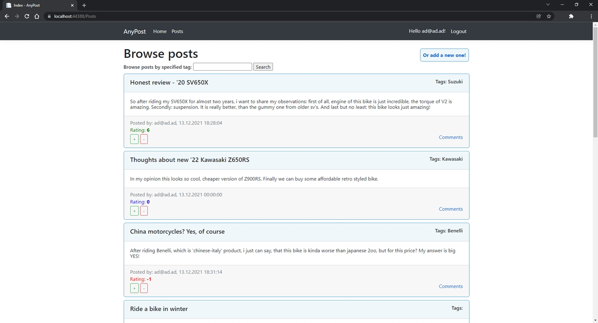
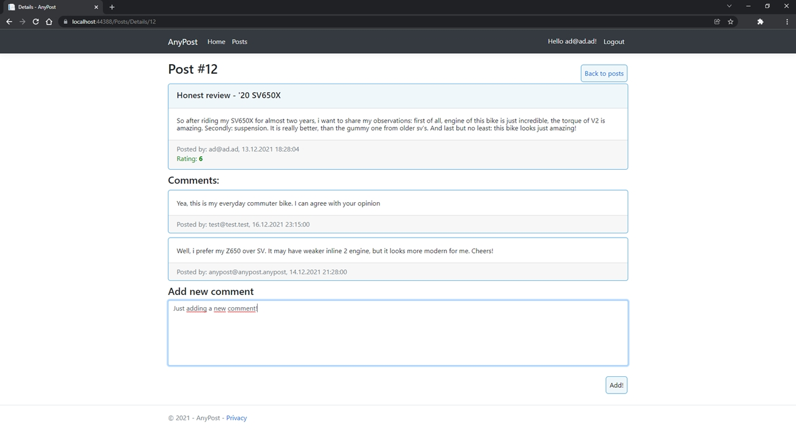

<h1 align="center">
 
</h1>

## Table of contents
* [Introduction](#introduction)
* [Features](#features)
* [Technologies](#technologies)
* [Screenshots](#screenshots)

## Introduction
Web application, which is kind of a simple discussion board. Users may create acoount, write posts, rate them, and add comments to them.
## Features
* Create user account
* Create post, with title, content, and tags (WIP)
* Browse posts, with various order options, and by tags (WIP)
* Add comments to posts
* Rate posts

## Technologies
* ASP.NET Core (MVC)
* Entity Framework Core
* MS-SQL Database
* Bootstrap
* CSS, HTML, JS

## Screenshots

 
 

