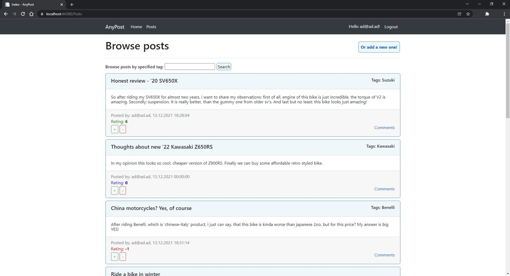

<h1 align="center">
 <strong>AnyPost</strong>
   
</h1>

## Table of contents
* [Introduction](#introduction)
* [Features](#features)
* [Technologies](#technologies)
* [Screenshots](#screenshots)

## Introduction
Simple web application, made for learning purposes. It allows user to register, browse posts, create and rate them. Currently still beeing developed.

## Features
* Create user account
* Create post, with title, content, and tags (WIP)
* Browse posts, with various order options, and by tags (WIP)
* Rate posts

## Technologies
* ASP.NET Core (MVC)
* Entity Framework Core
* MS-SQL Database
* Bootstrap
* CSS, HTML, JS

## Screenshots

 

